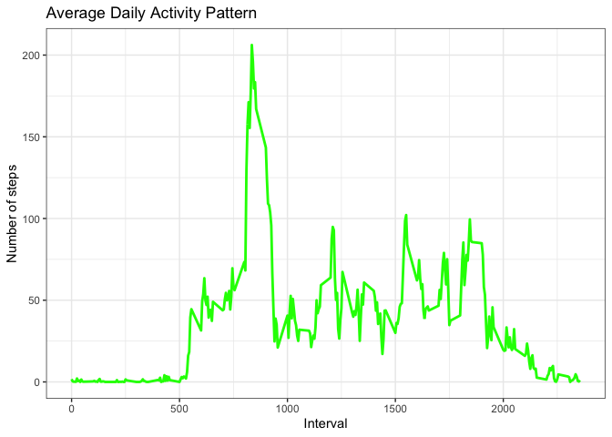
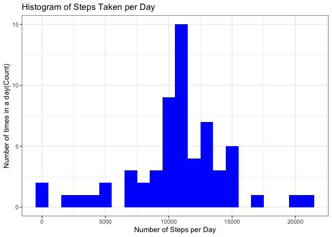
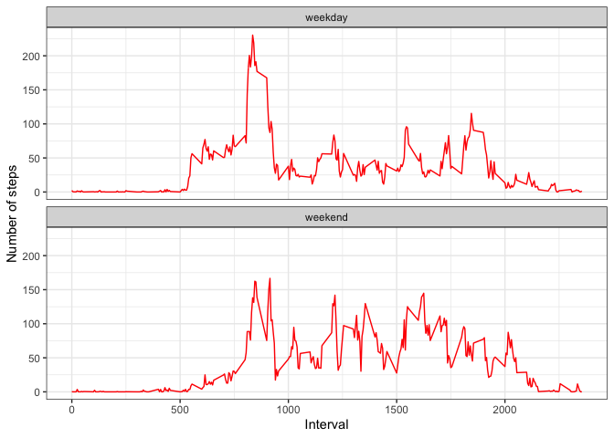

## Loading and preprocessing the data


```r
Activity <- read.csv("activity.csv", sep = ",") #Loading the .csv file
Activity$date <- as.Date(Activity$date, format = "%Y-%m-%d") #convert the date field to Date class
Activity$interval <- as.factor(Activity$interval) #convert the interval field to Factor class
ActivityFinal <- na.omit(Activity) #Removing the missing values
str(ActivityFinal) #Checking the data
```

```
## 'data.frame':	15264 obs. of  3 variables:
##  $ steps   : int  0 0 0 0 0 0 0 0 0 0 ...
##  $ date    : Date, format: "2012-10-02" "2012-10-02" ...
##  $ interval: Factor w/ 288 levels "0","5","10","15",..: 1 2 3 4 5 6 7 8 9 10 ...
##  - attr(*, "na.action")= 'omit' Named int  1 2 3 4 5 6 7 8 9 10 ...
##   ..- attr(*, "names")= chr  "1" "2" "3" "4" ...
```

## What is mean total number of steps taken per day?


```r
steps_per_day <- aggregate(steps ~ date, ActivityFinal, sum) #calculating the number of steps
colnames(steps_per_day) <- c("date","steps") #column names
head(steps_per_day) 
```

```
##         date steps
## 1 2012-10-02   126
## 2 2012-10-03 11352
## 3 2012-10-04 12116
## 4 2012-10-05 13294
## 5 2012-10-06 15420
## 6 2012-10-07 11015
```
#### Plotting the Histogram

```r
library(ggplot2) #Loading the ggplot library
```

```
## Warning: package 'ggplot2' was built under R version 3.6.2
```

```r
ggplot(steps_per_day, aes(x = steps)) +
        geom_histogram(fill = "blue", binwidth = 1000) +
        labs(title= "Steps taken per day - Histogram", 
             x = "Number of steps per day", y = "Number of times ina day(count)") + theme_bw()
```

<!-- -->

#### Mean - Steps

```r
mean_steps <- mean(steps_per_day$steps, na.rm=TRUE)
mean_steps
```

```
## [1] 10766.19
```
#### Median - Steps

```r
median_steps <- median(steps_per_day$steps, na.rm=TRUE)
median_steps
```

```
## [1] 10765
```
## What is the average daily activity pattern?

```r
steps_per_interval <- aggregate(ActivityFinal$steps, 
                                by = list(interval = ActivityFinal$interval),
                                FUN=mean, na.rm=TRUE)
#convert to integers
##this helps in plotting
steps_per_interval$interval <- 
        as.integer(levels(steps_per_interval$interval)[steps_per_interval$interval])
colnames(steps_per_interval) <- c("interval", "steps")
```
#### Plot with the time series of the average number of steps taken (averaged across all days) versus the 5-minute intervals

```r
ggplot(steps_per_interval, aes(x=interval, y=steps)) +
        geom_line(color = "green", size = 1) +
        labs(title="Average Daily Activity Pattern", x="Interval", y="Number of steps") +
        theme_bw()
```

<!-- -->
#### 5-minute interval with the containing the maximum number of steps

```r
max_interval <- steps_per_interval[which.max(  
        steps_per_interval$steps),]
```

## Imputing missing values
#### 1. Total number of missing values:

```r
missing_vals <- sum(is.na(Activity$steps))
```
#### 2. Strategy for filling in all of the missing values in the dataset

```r
na_fill <- function(data, pervalue) {
        na_index <- which(is.na(data$steps))
        na_replace <- unlist(lapply(na_index, FUN=function(idx){
                interval = data[idx,]$interval
                pervalue[pervalue$interval == interval,]$steps
        }))
        fill_steps <- data$steps
        fill_steps[na_index] <- na_replace
        fill_steps
}

rdata_fill <- data.frame(  
        steps = na_fill(Activity, steps_per_interval),  
        date = Activity$date,  
        interval = Activity$interval)
str(rdata_fill)
```

```
## 'data.frame':	17568 obs. of  3 variables:
##  $ steps   : num  1.717 0.3396 0.1321 0.1509 0.0755 ...
##  $ date    : Date, format: "2012-10-01" "2012-10-01" ...
##  $ interval: Factor w/ 288 levels "0","5","10","15",..: 1 2 3 4 5 6 7 8 9 10 ...
```


```r
sum(is.na(rdata_fill$steps)) #check that if there are any missing values remaining or not
```

```
## [1] 0
```
#### 3. A histogram of the total number of steps taken each day

```r
fill_steps_per_day <- aggregate(steps ~ date, rdata_fill, sum)
colnames(fill_steps_per_day) <- c("date","steps") #histogram of the daily total number of steps taken, plotted with a bin interval of 1000 steps, after filling missing values.

##plotting the histogram
ggplot(fill_steps_per_day, aes(x = steps)) + 
        geom_histogram(fill = "blue", binwidth = 1000) + 
        labs(title="Histogram of Steps Taken per Day", 
             x = "Number of Steps per Day", y = "Number of times in a day(Count)") + theme_bw() 
```

<!-- -->

#### The mean and median total number of steps taken per day

```r
steps_mean_fill   <- mean(fill_steps_per_day$steps, na.rm=TRUE)
steps_median_fill <- median(fill_steps_per_day$steps, na.rm=TRUE)
```
#### Do these values differ from the estimates from the first part of the assignment?
Yes, these values do differ slightly.

Before filling the data

Mean : 10766.189
Median: 10765
After filling the data

Mean : 10766.189
Median: 10766.189
We see that the values after filling the data mean and median are equal.

#### What is the impact of imputing missing data on the estimates of the total daily number of steps?
As you can see, comparing with the calculations done in the first section of this document, we observe that while the mean value remains unchanged, the median value has shifted and virtual matches to the mean.

Since our data has shown a t-student distribution (see both histograms), it seems that the impact of imputing missing values has increase our peak, but it's not affect negatively our predictions.

## Are there differences in activity patterns between weekdays and weekends?
We do this comparison with the table with filled-in missing values.
1. Augment the table with a column that indicates the day of the week
2. Subset the table into two parts - weekends (Saturday and Sunday) and weekdays (Monday through Friday).
3. Tabulate the average steps per interval for each data set.
4. Plot the two data sets side by side for comparison.

```r
weekdays_steps <- function(data) {
        weekdays_steps <- aggregate(data$steps, by=list(interval = data$interval),
                                    FUN=mean, na.rm=T)
        # convert to integers for plotting
        weekdays_steps$interval <- 
                as.integer(levels(weekdays_steps$interval)[weekdays_steps$interval])
        colnames(weekdays_steps) <- c("interval", "steps")
        weekdays_steps
}

data_by_weekdays <- function(data) {
        data$weekday <- 
                as.factor(weekdays(data$date)) # weekdays
        weekend_data <- subset(data, weekday %in% c("Saturday","Sunday"))
        weekday_data <- subset(data, !weekday %in% c("Saturday","Sunday"))
        
        weekend_steps <- weekdays_steps(weekend_data)
        weekday_steps <- weekdays_steps(weekday_data)
        
        weekend_steps$dayofweek <- rep("weekend", nrow(weekend_steps))
        weekday_steps$dayofweek <- rep("weekday", nrow(weekday_steps))
        
        data_by_weekdays <- rbind(weekend_steps, weekday_steps)
        data_by_weekdays$dayofweek <- as.factor(data_by_weekdays$dayofweek)
        data_by_weekdays
}

data_weekdays <- data_by_weekdays(rdata_fill)
```
Panel plot comparing the average number of steps taken per 5-minute interval across weekdays and weekends

```r
ggplot(data_weekdays, aes(x=interval, y=steps)) + 
        geom_line(color="red") + 
        facet_wrap(~ dayofweek, nrow=2, ncol=1) +
        labs(x="Interval", y="Number of steps") +
        theme_bw()
```

<!-- -->
